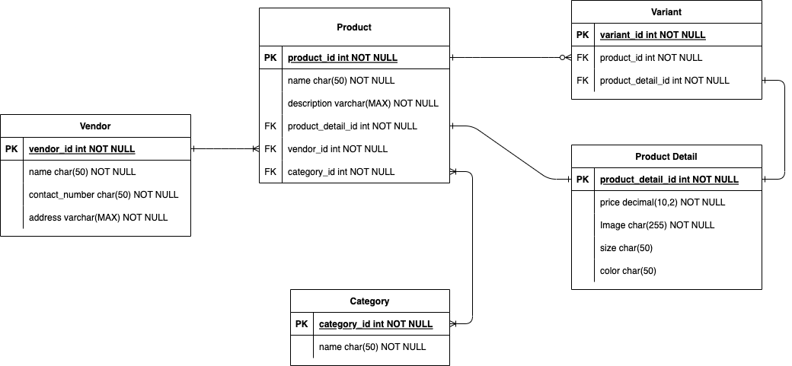

# Spring-Reactiv-Servlet
This is a Demo Application to evaluate the difference from Spring Servlet Stack over the Reactiv Stack

# Run the application
the application is split in different Docker-compose components. To Run the application the Reactiv/ and Servlet/ Module needs to be built with 
```bash
  gradle build
```
The build Jar are available in the build/libs folder. In anny case the Docker Image can't be build the jar can be build again. 

NOTE:
the tests will fail without a database connection. either start the Database or run without the tests

## Docker-compose
To run the application choose the stack you want to run and a Database from the .yml files. Run them Together with docker-compose

### build
```bash
  docker compose -f (filename) -f (filename) build
```
### up
```bash
  docker compose -f (filename) -f (filename) up
```
### example
```bash
  docker compose -f postgresql.yml -f servlet.yml up
```

The application is running on http://localhost:8080/

## Database Implementation
| Database Type | filename           | note |
|:-------------:|--------------------|------|
| PostgreSQL    | ``postgresql.yml`` |      |


All Database implementing the following data model if possible:

